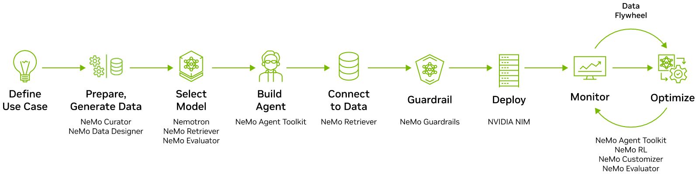

# Sommelier

Sommelier is a reference implementation for fine-tuning a small open language model to emit schema-valid tool calls. The project is currently in specification bootstrap: the repository contains the canonical product requirements, specification corpus, and RFCs that define the v1.0 implementation work.

## Canonical Documents

- [Product requirements](prd.md)
- [Specification index](SPEC.md)
- [Detailed specification](docs/spec/00-overview.md)
- [RFC index](SPEC.md#rfc-index)

## Scope

The v1.0 target is a single-GPU pipeline that prepares one tool-calling dataset, formats examples through the selected chat template, evaluates the base model, trains a parameter-efficient adapter, evaluates the adapter with the same prompts and parser, and writes a comparison report.

The project does not claim production serving readiness, broad agent reliability, or superiority over larger hosted models.

## Current Code

The package exposes configuration validation, dataset preparation with deterministic splits, fixture-mode stage stubs, and a Modal smoke app. The remote app lives in `sommelier.remote.app` (modal imported lazily, per the optional extras boundary); `sommelier_entrypoint.py` is a thin compatibility wrapper that materializes it.

### Commands

| Command | Status |
|---------|--------|
| `sommelier config validate` | Implemented |
| `sommelier data prepare` | Implemented (raw JSONL input or `--fixture`) |
| `sommelier data validate-fixtures` | Implemented |
| `sommelier format build` | Implemented (tokenizer template; `--fixture` for no-tokenizer builds) |
| `sommelier eval run` | Implemented (deterministic generations; the report gate lands with #27). Requires the model stack (torch/transformers), so it typically runs remotely |
| `sommelier train run` | Implemented (QLoRA adapter training; requires the train stack, so it typically runs remotely) |
| `sommelier report compare` | Implemented (comparison gate + `comparison_report.json`; Markdown rendering lands with #37) |
| `sommelier pipeline run` | Implemented (`--mode smoke` bounds split sizes and uses a `smoke-` run ID; `--mode full` runs configured sizes; chains data → format → base eval → train → adapter eval → compare). Train/eval stages need the model stack, so end-to-end runs happen remotely |
| `sommelier serve adapter` | Pending (#40) — fails with an explicit not-implemented error |

Command names and flags follow [docs/spec/02-public-api.md](docs/spec/02-public-api.md#cli-contract).

```bash
uv sync --extra dev
uv run ruff check .
uv run mypy sommelier tests
uv run pytest
uv run sommelier config validate --config examples/config.smoke.yaml
uv run sommelier data validate-fixtures
uv run sommelier data prepare --config examples/config.smoke.yaml --input tests/fixtures/preparation_rows.jsonl --out artifacts/runs/local/data --run-id local
uv run sommelier data prepare --config examples/config.smoke.yaml --fixture --out artifacts/runs/local/data --run-id local
uv run python sommelier_entrypoint.py
```

Optional GPU coarse filtering is available with `uv sync --extra data-gpu` and the `--gpu` flag on `sommelier data prepare`.

### Remote dependency images

Remote stages use separate Modal images defined in
`sommelier.remote.images`: a data image (GPU dataframe stack from the
NVIDIA index), a training image (torch/transformers/trl/peft/bitsandbytes/
accelerate/datasets), an evaluation image (torch/transformers/datasets),
and an optional serving image. Images are constructed lazily and never
imported at package import time. GPU selection and per-stage timeouts come
from the validated `remote` config section via `stage_options`. Version
pins land after the first green remote smoke run.

### Optional extras boundary

`import sommelier` never imports GPU, remote execution, or tracking
packages. External experiment tracking (wandb) is opt-in via the
`tracking` config section; when disabled (the default), local artifacts
and reports are complete on their own, and wandb is never imported. Heavy dependencies stay behind optional extras (for example
`data-gpu`) and are imported inside stage functions only when a command
needs them, so contributors on non-GPU machines can run the full local
suite. `tests/test_imports.py` enforces this boundary in CI.

## Diagram



## License

Sommelier is released under the [MIT License](LICENSE). Third-party model,
dataset, and package obligations are recorded in
[licenses/THIRD_PARTY.md](licenses/THIRD_PARTY.md).
