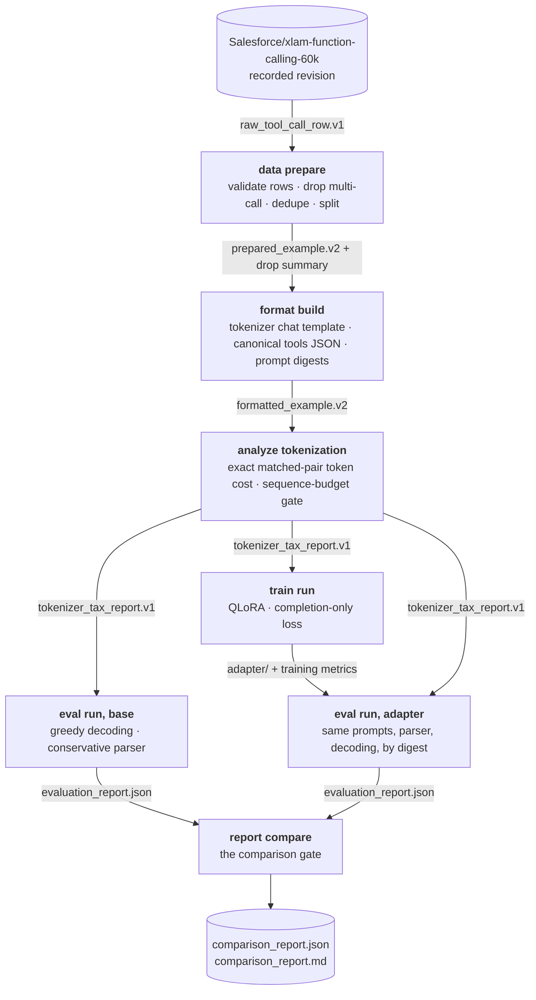

# The pipeline

Sommelier is a staged pipeline with one rule: stages communicate only through schema-versioned files under an artifact root. There is no hidden in-memory state between stages, no stage reads anything it did not declare as an input, and every transition writes a manifest with SHA-256 checksums of its inputs and outputs. The rule sounds bureaucratic until you need to answer "which prompts did the base model actually see" three weeks after the run. Then it is the whole point.

## Seven stages



Each stage is a CLI command, so you can run the whole chain with `sommelier pipeline run` or run any stage by hand and inspect what it wrote.

**1. `data prepare`.** Reads raw rows (untrusted JSON strings from the source dataset), validates them, drops what fails with a declared reason, deduplicates by normalized query, and writes seeded train/validation/test splits. A query hash can appear in exactly one split. Paired rows enter this stage with their translation summary and publication manifest as checksummed source inputs; full Hebrew evidence also carries the locked semantic-review template and finalized review. For a remote full run those files come from the paired dataset's immutable publication revision; translation-run staging is smoke-only. The drop summary records how many rows fell to each declared reason, so filtering is part of the record, not a footnote. Details in [Data policy](data.md).

**2. `format build`.** Renders each prepared example through the tokenizer's own chat template into `prompt_text`, `target_text`, and `full_text`, and records `prompt_sha256` for every prompt. The target is the canonical JSON of the gold call and nothing else. If the template does not render `full_text` as `prompt_text` followed by the target, the stage fails, because [training](training.md) needs a provable prompt boundary.

**3. `analyze tokenization`.** Tokenizes the exact stored query, prompt, target, and full training text, then joins every translated example to its root by `source_example_id`. It writes per-example counts, matched-pair ratios, coverage, distribution summaries, and the projected non-padding token workload. Any configured training row above `train.max_sequence_length` stops the pipeline here, before paid evaluation or training. Ratios describe this pinned tokenizer on this paired corpus; they are not a claim that a writing system alone caused the difference.

**4. `eval run --model base`.** Generates one completion per held-out test prompt with temperature 0.0 and sampling disabled, parses it conservatively, and writes every raw generation with its parse status plus bounded sequential generation telemetry. Parse failures are counted against every metric, never discarded. Details in [Evaluation method](evaluation.md).

**5. `train run`.** Trains a QLoRA adapter on the formatted train split with completion-only loss: prompt tokens are masked, and the mask boundary is proven at the token level before any gradient step. Hyperparameters come from the config and are never silently adjusted to fit hardware. Out-of-memory failures surface as errors that name the exact config fields to change.

**6. `eval run --model adapter`.** The same evaluation code, the same stored prompts, the same parser, the same decoding. The prompts are read from the formatted split by digest; evaluation never rebuilds them. Base and adapter runs write distinct `eval-base_manifest.json` and `eval-adapter_manifest.json` files.

**7. `report compare`.** The comparison gate. It refuses to produce a report unless both evaluation reports agree on the model identity, config digest, split, test-split digest, prompt-set digest, matched-pair digest, parser version, and decoding settings. When the digests match, it writes `comparison_report.json` (authoritative) and `comparison_report.md` (a human rendering), including paired-bootstrap confidence intervals. When they do not, it fails with an evaluation error naming the mismatched field. Details in [Determinism and the comparison gate](determinism.md).

## What a run leaves behind

```text
artifacts/runs/<run_id>/
├── config.resolved.yaml       the exact config, with its sha256 digest
├── manifest.json              run manifest: stage → manifest path, status
├── data/format/tokenization/train/report manifests
├── eval-base_manifest.json   base generation, telemetry, report evidence
├── eval-adapter_manifest.json adapter generation, telemetry, report evidence
├── data/                      splits + drop summary
├── formatted/                 rendered splits
├── analysis/tokenization/     paired token counts + tokenizer-tax report
├── train/                     adapter/ + training_metrics.jsonl
├── eval/base/                 generations + telemetry + evaluation report
├── eval/adapter/              generations + telemetry + evaluation report
├── report/                    comparison_report.json + .md
└── runtime_metadata.json      per-stage wall clock, GPU memory, cost fields
```

A failing stage stops the run with an exit code that names the problem, artifacts are written atomically so a crash cannot leave a half-written file under a final name, and a stage without its `succeeded` manifest makes no claims. A fresh run gets a fresh run ID rather than landing on top of an old one. Every file layout detail is in [Artifacts and schemas](../reference/artifacts.md).

## Three ways to run it

| Mode | What runs | What it needs |
|------|-----------|---------------|
| Fixture | The data and format stages against synthetic rows (`--fixture`) | Nothing: no GPU, no accounts, no downloads |
| Smoke | The full chain, capped at 100/20/20 examples | A GPU, about half an hour |
| Full | The configured full cohort, 15,000/1,000/1,000 in the reference and Hebrew v3 configs | A GPU, several hours; paired sources must be immutable, provenance-complete publications |

Smoke runs get a `smoke-` prefix on their run ID so a later full run can never overwrite smoke artifacts. A staged translation can prove smoke wiring, but cannot satisfy the full publication boundary. The GPU-free core is enforced, not aspirational: `import sommelier` never touches torch or CUDA, heavy stacks live behind optional extras and remote images, and an import-discipline test walks every module in a clean interpreter to keep it that way.

The Hebrew v3 release adds a report-only step after the independent base, v1,
and v3 runs. `sommelier report experiment` re-scores all three arms, applies
the preregistered claim gates, and embeds bounded tokenizer/QLoRA/inference TCO
evidence. It does not become an eighth training-pipeline stage because its
inputs deliberately span separate run identities.

## Why stages, and not a script

A single training script is easier to write and impossible to audit. The staged design buys three things:

1. **Rerunnability.** Each stage can be rerun and inspected in isolation. When a full run failed at hour three, the first two hours of artifacts were still valid and still checksummed.
2. **Fair comparison by construction.** Base and adapter evaluation are the same stage run twice. There is no separate "baseline script" that could quietly drift.
3. **Honest failure.** A stage that cannot meet its contract fails loudly with an [exit code that says whose fault it is](../reference/errors.md), instead of degrading into a result that looks fine and is not.
