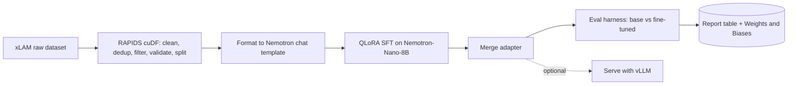

# Sommelier: Technical Specification

**Project:** Sommelier
**Companion document:** see `PRD.md` for goals, scope, and success metrics.

This document specifies the design and implementation of a single-GPU pipeline that fine-tunes `nvidia/Llama-3.1-Nemotron-Nano-8B-v1` for tool calling on `Salesforce/xlam-function-calling-60k`, using RAPIDS for data preparation, QLoRA for training, and an automatic evaluation, all orchestrated on Modal.

---

## 1. Overview

The pipeline has five stages: data preparation (RAPIDS), formatting, training (QLoRA), evaluation, and optional serving. Each stage is a Modal function that reads from and writes to a shared volume, so stages run independently and are individually testable. This separation also keeps the RAPIDS environment isolated from the training environment, which avoids dependency conflicts.

## 2. Architecture



Textual form: raw dataset, then RAPIDS preparation, then chat-template formatting, then QLoRA fine-tuning, then evaluation of base against fine-tuned, then a report, with an optional serving step.

## 3. Tech stack

| Concern | Choice | Notes |
|---------|--------|-------|
| Base model | `nvidia/Llama-3.1-Nemotron-Nano-8B-v1` | dense Llama 3.1 architecture, fits a single GPU, tuned for tool calling, requires `transformers >= 4.44.2` |
| Dataset | `Salesforce/xlam-function-calling-60k` | structured columns, clean for supervised fine-tuning and evaluation |
| Data preparation | RAPIDS cuDF | GPU dataframe operations |
| Fine-tuning | QLoRA via TRL, PEFT, and bitsandbytes | 4-bit, single GPU |
| Orchestration | Modal | code-first, per-second GPU billing, volumes, secrets |
| Serving (optional) | vLLM | OpenAI-compatible endpoint |
| Tracking | Weights and Biases | run logging and comparison |

Hardware: a single NVIDIA GPU with compute capability 7.0 or newer and CUDA 12. An L40S (48 GB) or A100-40GB is comfortable; an A10 or L4 (24 GB) works for QLoRA with a smaller batch and gradient accumulation.

## 4. Repository layout

```
sommelier/
  README.md
  PRD.md
  SPEC.md
  config.yaml               # all hyperparameters and paths
  modal_app.py              # images, volume, secrets, functions, entrypoint
  src/
    prep_rapids.py          # cuDF cleaning, dedup, filter, validate, split
    format_chat.py          # render rows into the chat template
    train_qlora.py          # QLoRA SFT with TRL and PEFT
    evaluate.py             # base vs fine-tuned harness and metrics
    serve_vllm.py           # optional serving
  results/
    baseline_metrics.json
    finetuned_metrics.json
    comparison.md
```

## 5. Data specification

### 5.1 Source schema

`xlam-function-calling-60k` rows have these fields:

- `id`: identifier.
- `query`: the user request, a string.
- `tools`: a JSON string, a list of available tool schemas.
- `answers`: a JSON string, a list of `{name, arguments}` objects, the gold tool calls.

### 5.2 RAPIDS preparation

Using cuDF on the GPU:

1. Load the raw dataset.
2. Drop rows with null `query`, `tools`, or `answers`.
3. Deduplicate on `query` to prevent train and test leakage.
4. Length-filter to drop empty or extreme-length queries.
5. Validate that `tools` and `answers` parse as JSON, and drop the rest.
6. Shuffle with a fixed seed, then split into train, validation, and test.

Keep the heavy row-level operations (deduplication, filtering, length) in cuDF. Do the per-row JSON validation and templating in plain Python.

### 5.3 Formatting

Each row becomes a chat sequence:

- system: a short instruction plus the available `tools`.
- user: the `query`.
- assistant (target): the `answers` JSON.

Render with the model tokenizer's `apply_chat_template`. Set the system prompt so reasoning is off, so the model emits the tool call directly.

### 5.4 Splits

Default sizes: 15000 train, 1000 validation, 1000 test. Configurable in `config.yaml`.

## 6. Model and training specification

### 6.1 Base model

`nvidia/Llama-3.1-Nemotron-Nano-8B-v1`, a dense decoder-only Transformer built on Llama 3.1 8B, loaded in 4-bit for QLoRA. Reasoning mode is controlled by the system prompt and is set to off for concise, parseable tool-call output.

### 6.2 QLoRA

- Quantization: 4-bit NF4, double quantization, bfloat16 compute.
- LoRA: rank 16, alpha 32, dropout 0.05, no bias.
- Target modules: `q_proj, k_proj, v_proj, o_proj, gate_proj, up_proj, down_proj`.
- Loss: completion-only, computed on the assistant tool-call tokens rather than the prompt.

### 6.3 Hyperparameters (starting point)

| Parameter | Value |
|-----------|-------|
| Epochs | 2 |
| Per-device batch size | 8 |
| Gradient accumulation | 2 (effective batch 16) |
| Learning rate | 2e-4 |
| Scheduler | cosine, warmup ratio 0.03 |
| Max sequence length | 2048 |
| Precision | bfloat16 |
| Packing | off |
| Seed | 42 |

### 6.4 Chat template and reasoning mode

Put the tool schemas in the system message, the request in the user message, and the gold JSON call as the assistant target. Set the system prompt so reasoning is off, so the output is a direct tool call without a thinking trace.

## 7. Evaluation specification

### 7.1 Metrics

Computed on the held-out test set, for both base and fine-tuned:

1. **Valid-JSON rate:** the output parses as a JSON tool call.
2. **Function-name accuracy:** the predicted tool name matches gold.
3. **Argument exact-match:** the predicted argument object equals gold.
4. **Argument F1:** per-key precision and recall, for partial credit.
5. **Full-call exact-match:** name and arguments both correct.

### 7.2 Methodology

- Deterministic decoding: greedy, temperature 0, for reproducibility.
- Identical prompt and parser for base and fine-tuned, for a fair comparison.
- Robust parsing: extract the first JSON object from the output, and count a parse failure as an automatic miss.
- Output one comparison table, base versus fine-tuned, and log both runs to Weights and Biases.

### 7.3 Optional standard benchmark

The model can be run through a standard function-calling benchmark such as the Berkeley Function-Calling Leaderboard for an external number. This is a stretch item; the custom harness is the primary result.

## 8. Infrastructure specification (Modal)

### 8.1 Images

Three images, to isolate RAPIDS from the training stack:

- **Data image:** a CUDA 12 base plus `cudf-cu12` from the NVIDIA package index (or a `rapidsai/base` container).
- **Train image:** a CUDA 12 base plus `torch, transformers, trl, peft, bitsandbytes, accelerate, datasets, wandb`.
- **Eval and serve image:** `vllm` plus `transformers` and `datasets`.

Pin versions once a run is green. Obtain the exact RAPIDS install command from the RAPIDS release selector, matched to CUDA 12.

### 8.2 Volume and secrets

- Volume `sommelier-vol` holds raw data, cleaned splits, adapters, and the merged model.
- Secrets `huggingface` (a token, with the model license accepted first) and `wandb` (an API key).

### 8.3 Functions and entrypoint

- `prep` on the data image, no GPU.
- `train` on the train image, one GPU.
- `evaluate` on the eval image, one GPU, parameterized by base or fine-tuned.
- `serve` on the eval image, one GPU, optional.
- A local entrypoint chains prep, baseline eval, train, and fine-tuned eval.

### 8.4 Cost controls

Smoke-test on 100 examples before the full run, set function timeouts, prefer spot or community GPUs where available, and rely on per-second billing so nothing idle is charged.

## 9. Serving specification (optional)

Merge the LoRA adapter into the base model, then serve with vLLM behind an OpenAI-compatible API. Send sample requests and confirm correct tool calls.

## 10. Configuration

All tunable values live in `config.yaml`; see Appendix E. Code reads from this file so runs are reproducible and easy to vary.

## 11. Module interfaces

| Module | Function | Contract |
|--------|----------|----------|
| `prep_rapids` | `run(in_path, out_path, n_train, n_val, n_test, seed)` | writes `train.jsonl`, `val.jsonl`, `test.jsonl` |
| `format_chat` | `to_messages(row, tokenizer) -> str` | renders one row to a chat-template string |
| `train_qlora` | `run(model, data, out)` | trains and saves an adapter to `out` |
| `evaluate` | `run(model, adapter, data) -> dict` | returns and logs the metric dict |
| `serve_vllm` | `run(model_path)` | starts an OpenAI-compatible endpoint |

## 12. Reproducibility

A fixed seed, a single configuration file, pinned dependencies, and deterministic (greedy) decoding at evaluation time. The same prompt and parser are used for base and fine-tuned models.

## 13. Build sequence

Maps to the phases in `PRD.md`.

0. **Setup.** Create accounts, accept the model license, create the `huggingface` and `wandb` secrets, `pip install modal`, and run `modal setup`. Verify with a hello function on a GPU.
1. **Data.** Download the dataset into the volume, then run `prep`. Check the split counts.
2. **Format.** Confirm a few rendered chat examples look correct.
3. **Baseline.** Run `evaluate` with the base model. Save `baseline_metrics.json`.
4. **Train.** Run `train`. Watch the loss curve. Save the adapter.
5. **Evaluate.** Run `evaluate` with the adapter, then produce the base versus fine-tuned table.
6. **Stretch.** Merge and serve with vLLM, add a multilingual slice, or run the standard benchmark.

---

## Appendix A. Modal app skeleton

```python
# modal_app.py  (illustrative, pin versions once it runs)
import modal

APP = "sommelier"
MODEL = "nvidia/Llama-3.1-Nemotron-Nano-8B-v1"

# Data image: RAPIDS, kept separate from the training stack
data_image = (
    modal.Image.from_registry("nvidia/cuda:12.4.1-devel-ubuntu22.04", add_python="3.11")
    .pip_install("cudf-cu12", extra_index_url="https://pypi.nvidia.com")  # use the RAPIDS selector for the exact pin
    .pip_install("datasets", "huggingface_hub", "pandas")
)

# Training image: torch and the PEFT stack
train_image = (
    modal.Image.from_registry("nvidia/cuda:12.4.1-devel-ubuntu22.04", add_python="3.11")
    .pip_install(
        "torch==2.4.0", "transformers>=4.44.2", "trl==0.11.4", "peft==0.13.2",
        "bitsandbytes==0.44.1", "accelerate==1.0.1", "datasets==3.0.1", "wandb",
    )
)

# Eval and serve image
eval_image = modal.Image.from_registry(
    "nvidia/cuda:12.4.1-devel-ubuntu22.04", add_python="3.11"
).pip_install("vllm", "transformers>=4.44.2", "datasets", "wandb")

app = modal.App(APP)
vol = modal.Volume.from_name("sommelier-vol", create_if_missing=True)
secrets = [modal.Secret.from_name("huggingface"), modal.Secret.from_name("wandb")]

@app.function(image=data_image, volumes={"/vol": vol}, timeout=60 * 30)
def prep():
    from src.prep_rapids import run
    run(in_path="/vol/raw", out_path="/vol/data")
    vol.commit()

@app.function(image=train_image, gpu="L40S", volumes={"/vol": vol},
              secrets=secrets, timeout=60 * 60 * 4)
def train():
    from src.train_qlora import run
    run(model=MODEL, data="/vol/data", out="/vol/out")
    vol.commit()

@app.function(image=eval_image, gpu="L40S", volumes={"/vol": vol},
              secrets=secrets, timeout=60 * 60 * 2)
def evaluate(which: str = "base"):
    from src.evaluate import run
    run(model=MODEL, adapter=None if which == "base" else "/vol/out", data="/vol/data")

@app.local_entrypoint()
def main():
    prep.remote()
    evaluate.remote("base")
    train.remote()
    evaluate.remote("finetuned")
```

## Appendix B. RAPIDS preparation skeleton

```python
# src/prep_rapids.py  (illustrative)
import cudf, json

def _is_json(s):
    try:
        json.loads(s); return True
    except Exception:
        return False

def run(in_path, out_path, n_train=15000, n_val=1000, n_test=1000, seed=42):
    # xLAM columns: query, tools, answers  (tools and answers are JSON strings)
    df = cudf.read_parquet(f"{in_path}/xlam.parquet")

    # clean and filter on the GPU
    df = df.dropna(subset=["query", "tools", "answers"])
    df = df.drop_duplicates(subset=["query"])          # prevent leakage before splitting
    df["qlen"] = df["query"].str.len()
    df = df[(df["qlen"] > 10) & (df["qlen"] < 2000)]

    # JSON validity check on CPU (small, after filtering)
    pdf = df.to_pandas()
    pdf = pdf[pdf["tools"].map(_is_json) & pdf["answers"].map(_is_json)]

    pdf = pdf.sample(frac=1.0, random_state=seed).reset_index(drop=True)
    train = pdf.iloc[:n_train]
    val   = pdf.iloc[n_train:n_train + n_val]
    test  = pdf.iloc[n_train + n_val:n_train + n_val + n_test]

    for name, part in [("train", train), ("val", val), ("test", test)]:
        part.to_json(f"{out_path}/{name}.jsonl", orient="records", lines=True)
    print({"train": len(train), "val": len(val), "test": len(test)})
```

## Appendix C. QLoRA training skeleton

```python
# src/train_qlora.py  (illustrative)
import torch
from datasets import load_dataset
from transformers import AutoTokenizer, AutoModelForCausalLM, BitsAndBytesConfig
from peft import LoraConfig
from trl import SFTTrainer, SFTConfig

SYSTEM = "detailed thinking off"  # keep reasoning off for concise tool-call output

def to_messages(row, tok):
    messages = [
        {"role": "system", "content": f"{SYSTEM}\nAvailable tools:\n{row['tools']}"},
        {"role": "user", "content": row["query"]},
        {"role": "assistant", "content": row["answers"]},
    ]
    return tok.apply_chat_template(messages, tokenize=False)

def run(model, data, out):
    tok = AutoTokenizer.from_pretrained(model)
    tok.pad_token = tok.pad_token or tok.eos_token

    bnb = BitsAndBytesConfig(
        load_in_4bit=True, bnb_4bit_quant_type="nf4",
        bnb_4bit_use_double_quant=True, bnb_4bit_compute_dtype=torch.bfloat16,
    )
    base = AutoModelForCausalLM.from_pretrained(
        model, quantization_config=bnb, device_map="auto",
        torch_dtype=torch.bfloat16, attn_implementation="flash_attention_2",
    )
    peft_cfg = LoraConfig(
        r=16, lora_alpha=32, lora_dropout=0.05, bias="none", task_type="CAUSAL_LM",
        target_modules=["q_proj","k_proj","v_proj","o_proj","gate_proj","up_proj","down_proj"],
    )
    ds = load_dataset("json", data_files={
        "train": f"{data}/train.jsonl", "val": f"{data}/val.jsonl"})
    ds = ds.map(lambda r: {"text": to_messages(r, tok)})

    cfg = SFTConfig(
        output_dir=out, num_train_epochs=2,
        per_device_train_batch_size=8, gradient_accumulation_steps=2,
        learning_rate=2e-4, lr_scheduler_type="cosine", warmup_ratio=0.03,
        bf16=True, logging_steps=10, save_strategy="epoch",
        max_seq_length=2048, packing=False, dataset_text_field="text",
        gradient_checkpointing=True, report_to="wandb", seed=42,
    )
    # For best quality, add a completion-only collator so loss is computed on the
    # assistant tool-call tokens only (see TRL DataCollatorForCompletionOnlyLM).
    trainer = SFTTrainer(
        model=base, args=cfg,
        train_dataset=ds["train"], eval_dataset=ds["val"], peft_config=peft_cfg,
    )
    trainer.train()
    trainer.save_model(out)
```

## Appendix D. Evaluation harness skeleton

```python
# src/evaluate.py  (illustrative)
import json, re
from datasets import load_dataset
from vllm import LLM, SamplingParams

def first_json(text):
    m = re.search(r"\{.*\}|\[.*\]", text, re.DOTALL)
    if not m:
        return None
    try:
        return json.loads(m.group(0))
    except Exception:
        return None

def score(pred, gold):
    out = {"valid": 0, "name": 0, "arg_exact": 0, "full": 0}
    if pred is None:
        return out
    out["valid"] = 1
    p = pred[0] if isinstance(pred, list) else pred
    g = gold[0] if isinstance(gold, list) else gold
    if p.get("name") == g.get("name"):
        out["name"] = 1
    if p.get("arguments") == g.get("arguments"):
        out["arg_exact"] = 1
    if out["name"] and out["arg_exact"]:
        out["full"] = 1
    return out

def run(model, adapter, data):
    llm = LLM(model=model, enable_lora=adapter is not None, trust_remote_code=True)
    sp = SamplingParams(temperature=0.0, max_tokens=512)  # greedy, deterministic
    test = load_dataset("json", data_files={"test": f"{data}/test.jsonl"})["test"]

    prompts, golds = [], []
    for r in test:
        prompts.append(
            f"detailed thinking off\nAvailable tools:\n{r['tools']}\n\nUser: {r['query']}\nAssistant:")
        golds.append(json.loads(r["answers"]))

    # pass the LoRA adapter to generate(...) when adapter is not None
    outs = llm.generate(prompts, sp)
    agg = {"valid": 0, "name": 0, "arg_exact": 0, "full": 0}
    for o, g in zip(outs, golds):
        s = score(first_json(o.outputs[0].text), g)
        for k in agg:
            agg[k] += s[k]
    n = len(golds)
    metrics = {k: round(100 * v / n, 1) for k, v in agg.items()}
    print(metrics)  # log to Weights and Biases and save to results/
    return metrics
```

## Appendix E. config.yaml

```yaml
project: sommelier
model: nvidia/Llama-3.1-Nemotron-Nano-8B-v1
dataset: Salesforce/xlam-function-calling-60k
data:
  n_train: 15000
  n_val: 1000
  n_test: 1000
  seed: 42
train:
  epochs: 2
  batch_size: 8
  grad_accum: 2
  lr: 2.0e-4
  scheduler: cosine
  warmup_ratio: 0.03
  max_seq_len: 2048
  lora_r: 16
  lora_alpha: 32
  lora_dropout: 0.05
eval:
  temperature: 0.0
  max_tokens: 512
compute:
  provider: modal
  gpu: L40S              # A100-40GB works; A10 or L4 for a smaller budget
serve:
  engine: vllm
```

---

*Verify all licenses before publishing artifacts, and add a "Built with Llama" notice to anything derived from the base model. The code above is illustrative; pin versions once your first run is green.*